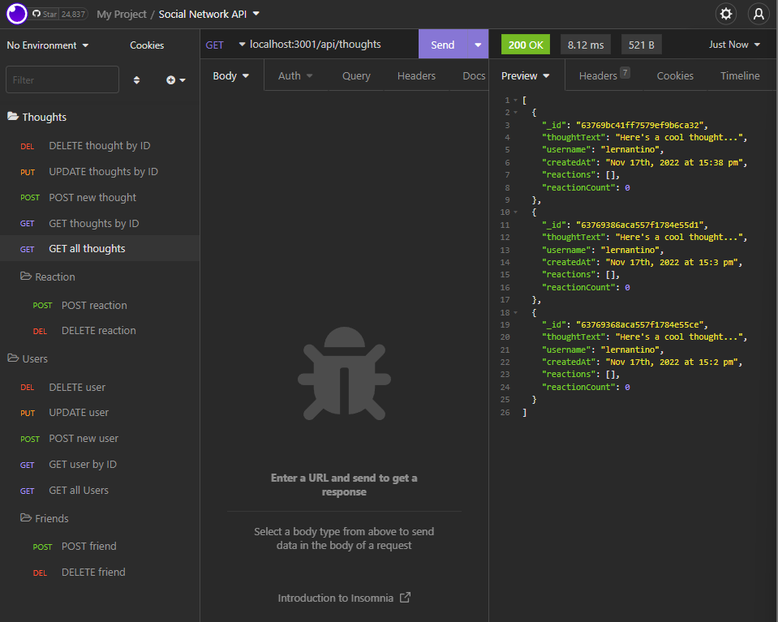

# Network With Me!

  

  # Description
This is a social networking API called Network with me! This utilizes MongoDB and Insomnia to CRUD users and thoughts. Being able to add thoughts, reactions, users, and friends

  # Installation
  The following necessary dependencies must be installed to run the application

        npm install

After dependencies have been downloaded, you can start the server by npm start    

  # Usage
  In order to use this app, you will need Visual Studio Code, Javascript, Node.js, Mongoose, and Express.js. 

  # Questions
  If you have any questions about the repository, please contact/email benny.le890@gmail.com  
  My GitHub profile is found at [GitHub Profile](https//GitHub.com/bennyle890)
